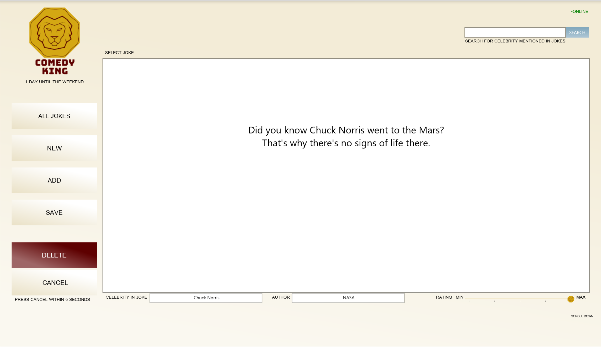

# Comedy King

Comedy King is a project to learn more about the Universal Windows Platform (UWP)

Comedy King allows the users to read celebrity jokes from a database of jokes. 
The jokes contains text and additional information such as the celebrity mentioned in the joke, author and a ranking. 
This data can be changed and stored again or deleted. The users can also add their own jokes to the database. 
Later the users can search for the celebrity to find the jokes more quickly.

